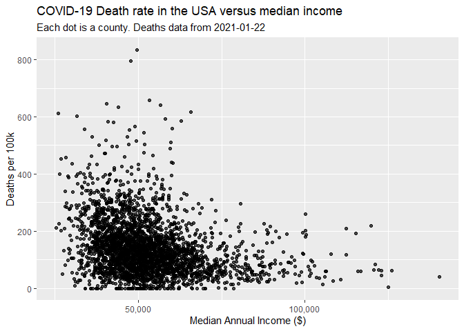

<!-- README.md is generated from README.Rmd. Please edit that file -->

# covidCensus

The goal of covidCensus is to easily join county level COVID-19 case and
death data with other information from the census (eg income,
demographic statistics, population density). The purpose of its creation
was educational. I had been exploring COVID-19 data for awhile and
wanted to observe patterns between health outcomes and other social
markers.

Note: I am not a professional researcher, just a hobbyist. Any findings
from this study should be taken with a grain of salt.

## Installation

covidCensus is not on CRAN, but this is how to install it from Github.

``` r
devtools::install_github("shuckle16/covidCensus")
```

## Structure

Currently there are 4 `fetch_` functions for retrieving the data you
want. Each of them returns the raw response from an http request.

  - `fetch_nyt`
  - `fetch_census_dens`
  - `fetch_census_demo`
  - `fetch_census_income`

There are also 4 corresponding `tidy_` functions to clean up the above
data so they can be joined together.

  - `tidy_nyt`
  - `tidy_census_dens`
  - `tidy_census_demo`
  - `tidy_census_income`

## Example

This is a basic example which shows you how to solve a common problem:

``` r
library(dplyr)
#> Warning: package 'dplyr' was built under R version 4.0.3
#> 
#> Attaching package: 'dplyr'
#> The following objects are masked from 'package:stats':
#> 
#>     filter, lag
#> The following objects are masked from 'package:base':
#> 
#>     intersect, setdiff, setequal, union
library(ggplot2)
library(covidCensus)

tidied_nyt <- fetch_nyt() %>% tidy_nyt()
#> Parsed with column specification:
#> cols(
#>   date = col_date(format = ""),
#>   county = col_character(),
#>   state = col_character(),
#>   fips = col_character(),
#>   cases = col_double(),
#>   deaths = col_double()
#> )

tidied_census_dens <- fetch_census_dens() %>% tidy_census_dens()

tidied_census_income <- fetch_census_income() %>% tidy_census_income()
#> Warning: The `x` argument of `as_tibble.matrix()` must have unique column names if `.name_repair` is omitted as of tibble 2.0.0.
#> Using compatibility `.name_repair`.
#> This warning is displayed once every 8 hours.
#> Call `lifecycle::last_warnings()` to see where this warning was generated.
#> Joining, by = "state.abb"

join_datasets <- function() {
  tidied_census_income %>%
    inner_join(tidied_census_dens, by = c("county", "state")) %>% 
    inner_join(tidied_nyt)
}

joined_data <- join_datasets() 
#> Joining, by = c("county", "state")

joined_data %>%   
  filter(county != "New York") %>% 
  ggplot(aes(x = median_income, y = (deaths / pop) * 100000)) + 
  geom_point(alpha = 0.7) + 
  scale_x_continuous(labels = scales::comma) +
  xlab("Median Annual Income ($)") + 
  ylab("Deaths per 100k") + 
  ggtitle(
    "COVID-19 Death rate in the USA versus median income", 
    subtitle = paste("Each dot is a county. Deaths data from", max(tidied_nyt$date))
    )
#> Warning: Removed 1 rows containing missing values (geom_point).
```



## To do list

  - Consider using {[polite](https://github.com/dmi3kno/polite)} package
    instead of xml2. There might be a nicer way to make the census api
    calls, too. Suggestions welcome
  - Find other interesting county-level variables
  - Add tests? consistent names from the `tidy` functions, etc
  - Add a vignette or two
